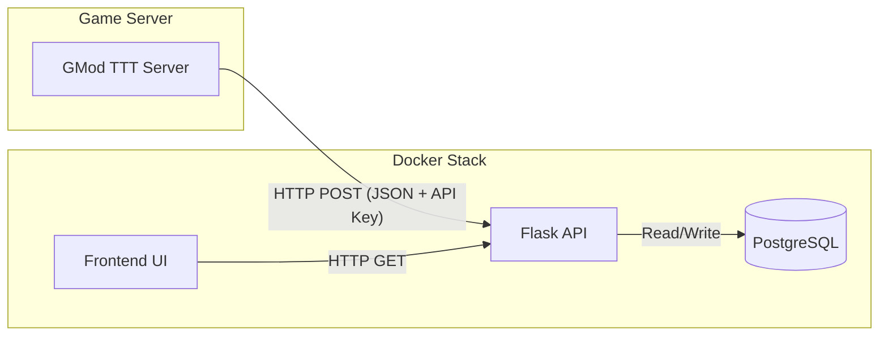

# TTT Stats Collector

This repository contains a complete system for collecting, storing, and visualizing statistics from the "Trouble in Terrorist Town" (TTT) gamemode in Garry's Mod.

## Architecture

The system is composed of three main components:

1.  **GMod Addon (`addon/`)**: A Lua script that runs on the Garry's Mod server. It hooks into game events (Round End, Player Death, etc.) and sends data to the API via HTTP.
2.  **Backend API (`backend/`)**: A Flask-based REST API that receives data from the addon, validates it, and stores it in a PostgreSQL database. It also provides endpoints for retrieving statistics.
3.  **Frontend (`frontend/`)**: A web interface for visualizing the collected statistics. (Currently a stub/placeholder).

### Data Flow Diagram

## Repository Structure

*   `addon/`: Contains the Lua source code for the Garry's Mod addon.
*   `backend/`: Contains the Python/Flask source code for the REST API.
*   `frontend/`: Contains the source code for the web frontend (Stub).
*   `docker-compose.yml`: Docker Compose configuration to run the Backend, Frontend, and Database services.

## Getting Started

To run the infrastructure (API, Database, Frontend):

1.  Ensure you have Docker and Docker Compose installed.
2.  Run `docker-compose up --build`.

To install the addon:

1.  Copy the contents of the `addon/` directory to your Garry's Mod server's `garrysmod/addons/` folder.
2.  Configure the API URL and API Key using the provided ConVars (see `addon/README.md`).
